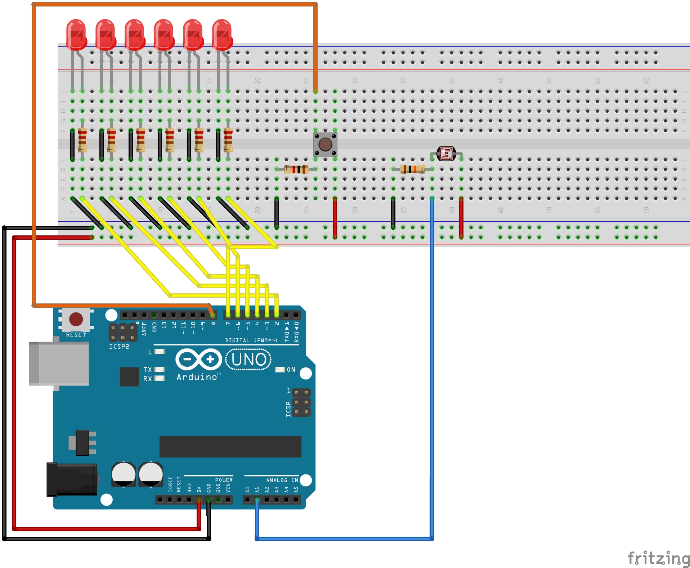

<div align="center">
   <h1>
      <s>SHITTY</s> LED Dice
   </h1>
   <p>
      I present to you a <s>shitty</s> LED dice.
      I mean to be real, it doesn't even looks like a dice.
      But hey it works
   </p>
</div>

## How it works

It's a pretty simple project, the Arduino generates a random number between 1 and 6 and displays the numbers by powering the right amount of LEDs.

~~I might add a real random number generator/[hardware generator in the future](https://en.wikipedia.org/wiki/Hardware_random_number_generator), you know one that uses hardware and generates numbers based on a physical process rather than some stupidly smart algorithm.
But for this I need to do some research on how to buid these thing with the hardware I have.~~

The random number is generated using the `random()` function.
Since random numbers generated by a computer are not really random (I recommend watching this [video](https://www.youtube.com/watch?v=-h_rj2-HP2E) by [PwnFunction](https://www.youtube.com/c/PwnFunction) for more information), I tried to make the Arduino generate a random seed every time the button is pressed for the first time.
The seed is calculated by using the value returned by the `millis()` functions and the analog values of A0, A1, and A2.

- `millis()` will return the number of milliseconds passed since the Arduino board began running the current program.
- `A0` is not connected to anything, this means it is a floating value.
- `A1` is connected to an LDR, this means that the value is influenced by the amount of light in the room.
- `A2` like `A0` connected to nothing to give it a floating value.

The seed is calculated using the following equation:

```c++
seed = ((millis() + analogRead(A0) / analogRead(A1) * analogRead(A2)) * 15485863) % 2038074743;
```

This method isn't really random like a true hardware random number generator, but it's good enough for playing a board game like Monopoly.
To compile and upload the code to the Arduino enter the following commands.

**NOTE**: The commands below assume you are using an Arduino UNO. Refer to the [docs](https://arduino.github.io/arduino-cli/0.27/getting-started/) for more information.

```
$ cd src/                                                             # Navigate inside the source directory
$ arduino-cli compile --fqbn arduino:avr:uno led-dice                 # Compile the code
$ arduino-cli upload -p /dev/ttyACM0 --fqbn arduino:avr:uno led-dice  # Upload the compiled code to the Arduino UNO
```

**NOTE**: don't forget to update the permissions of `/dev/ttyACM0` (`sudo chmod a+rw /dev/ttyACM0`).

## Electrical scheme



